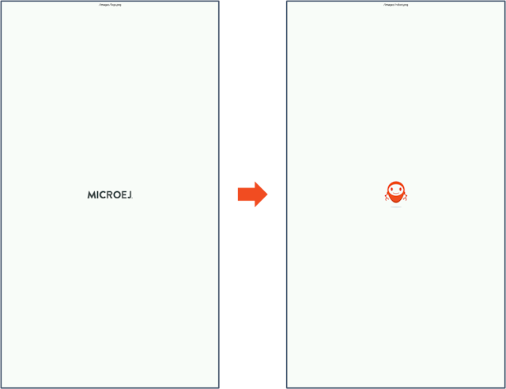

# Overview

The External Images Example illustrates the use of the [External Resources Loader](https://docs.microej.com/en/latest/PlatformDeveloperGuide/externalResourceLoader.html) by displaying
images supposed to be in an external memory (used for resources stored on non-byte-addressable memories, like a filesystem).

# Requirements

- MICROEJ SDK 6.
- A VEE Port that contains (at least):
	- EDC-1.3
	- MICROUI-3.6
	- With the module [External Resources Loader](https://docs.microej.com/en/latest/VEEPortingGuide/externalResourceLoader.html#installation) enabled

This example has been tested on:

- IntelliJ IDEA with MicroEJ plugin for IntelliJ IDEA ``1.1.0``.
- [NXP i.MX RT1170 VEE Port 3.0.0](https://github.com/MicroEJ/nxp-vee-imxrt1170-evk/tree/NXPVEE-MIMXRT1170-EVK-3.0.0)
  with the ``External Resources Loader`` module enabled.

# Usage

No default VEE Port has been configured to run this sample.

It is recommended to start using this sample with the
[NXP i.MX RT1170 VEE Port 3.0.0](https://github.com/MicroEJ/nxp-vee-imxrt1170-evk/tree/NXPVEE-MIMXRT1170-EVK-3.0.0).
Complete the [Getting Started for NXP i.MX RT1170 Evaluation Kit](https://docs.microej.com/en/latest/SDK6UserGuide/gettingStartedIMXRT1170.html)
to make sure your environment is fully setup.

If you are using an other VEE Port, make sure to properly setup the VEE Port environment
before going further. Refer to the dedicated VEE Port README or Getting Started for more information.
Refer to the [Select a VEE Port](https://docs.microej.com/en/latest/SDK6UserGuide/selectVeePort.html) documentation for more information about using a VEE Port in your project.

## Enable the External Resources Loader Module in the VEE Port

Enable the External Resources Loader Module in the VEE Port in order to run this sample. 

Refer to the [External Resources Loader](https://docs.microej.com/en/latest/VEEPortingGuide/externalResourceLoader.html#installation)
installation section to enable the module in your VEE Port.

## Configuring the Images Heap Size

Depending on the size of the image resources used, the [MicroUI Images Heap](https://docs.microej.com/en/latest/ApplicationDeveloperGuide/UI/MicroUI/images.html#images-heap)
needs to be increased.

In this example, the images heap is already configured to work properly. It has been set to 128Kb.
The images heap needs to be configured for the simulator and the embedded target as well.

To modify the Images heap size, update the ``ej.microui.memory.imagesheap.size ``
configuration option in: ``configuration/common.properties``.

## Run on Simulator

Run the following command in your IDE
(or click the ``Play`` button next to the line
below when opening this README in IntelliJ IDEA):

`./gradlew :ExternalImages:runOnSimulator`

The simulator should start and display the loaded images. Click on the screen to switch between images.

Alternative ways to run in simulation are described in the [Run on Simulator](https://docs.microej.com/en/latest/SDK6UserGuide/runOnSimulator.html) documentation.
	
## Run on Device

Make sure to properly setup the VEE Port environment before going further.
Refer to the VEE Port README or Getting Started for more information.

### External Resource Generation

When building the application project for the Device, the images to embed on the target are generated under
``build/application/object/externalResources/``:
- ``images/logo.png``
- ``images/robot.png``

Those resources will be loaded using the External Resources Loader.
It is the developer responsibility to make sure that the resources will be available on the target before starting the application.

In this sample, ``logo.png`` and ``robot.png`` are already provided in [logo_image.c](../LLEXT_loader_implementation/src/logo_image.c)
and [robot_image.c](../LLEXT_loader_implementation/src/robot_image.c).

### Adding LLEXT C Sources to the BSP Project

Some C sources need to be added to the BSP project in order to run the sample:

- [LLEXT_static_array.c](../LLEXT_loader_implementation/src/LLEXT_static_array.c): provides a simple implementation of the External Resources Module Low Level APIs.
- External Resources (images and translations stored in C arrays in hexadecimal format):
	- [logo_image.c](../LLEXT_loader_implementation/src/logo_image.c)
	- [robot_image.c](../LLEXT_loader_implementation/src/robot_image.c)
	- [hello_world_translations.c](../LLEXT_loader_implementation/src/hello_world_translations.c)
	- [external_resources.h](../LLEXT_loader_implementation/inc/external_resources.h)

Those sources are located in the [LLEXT_loader_implementation](../LLEXT_loader_implementation) folder of the repository.

The procedure below shows an example of how to integrate those sources in the
``NXP i.MX RT1170 VEE Port`` BSP project:

- Copy / Paste the content of the [LLEXT_loader_implementation](../LLEXT_loader_implementation) folder to the ``bsp\vee\src\main`` folder of the VEE Port,
- Declare those new sources in the following file: ``bsp/vee/scripts/armgcc/CMakeLists.txt``:
  ``` C
  add_executable(${MCUX_SDK_PROJECT_NAME}
      "${MicroEjRootDirPath}/src/main/src/LLEXT_static_array.c"
      "${MicroEjRootDirPath}/src/main/src/logo_image.c"
      "${MicroEjRootDirPath}/src/main/src/robot_image.c"
      "${MicroEjRootDirPath}/src/main/src/hello_world_translations.c"
      ...
  target_include_directories(${MCUX_SDK_PROJECT_NAME} PUBLIC
      ${MicroEjRootDirPath}/src/main/inc
      ...
  ```

### Build and Run on Device

Run the following command in your IDE
(or click the ``Play`` button next to the line
below when opening this README in IntelliJ IDEA):

`./gradlew :ExternalImages:runOnDevice`

Alternative ways to run on device are described in the [Run on Device](https://docs.microej.com/en/latest/SDK6UserGuide/runOnDevice.html) documentation.

## Expected Behavior

The following content can be seen on the screen once the application has started. Click on the screen to switch between images:



## Loading a Resource from a Non Byte-addressable Memory

Depending on the resource size and on the use case, the resource can be stored either in a byte addressable
memory or in a non-byte-addressable memory. 

- When the resource is stored in a byte addressable memory, it is directly loaded from its location.
- When the resource is stored in a non-byte addressable memory, it is first sought in that memory and then 
  copied and loaded from RAM.

By default, the [LLEXT_static_array.c](../LLEXT_loader_implementation/src/LLEXT_static_array.c) driver loads the images from a byte addressable
memory. To simulate a loading from a non-byte addressable memory, uncomment the `#define NON_BYTE_ADDRESSABLE` line in the [LLEXT_static_array.c](../LLEXT_loader_implementation/src/LLEXT_static_array.c) file.

# Dependencies

_All dependencies are retrieved transitively by MicroEJ Module Manager_.

# Source

N/A.

# Restrictions

None.

---
_Markdown_   
_Copyright 2015-2025 MicroEJ Corp. All rights reserved._  
_Use of this source code is governed by a BSD-style license that can be found with this software._  